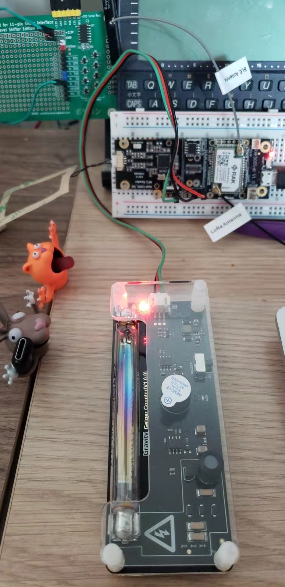

# RAK4631_DFRobot_Geiger

Adapted from the DFRobot code for [RAK4631](https://store.rakwireless.com/products/rak4631-lpwan-node). A sample sketch that reads from a [Gravity Geiger counter](https://wiki.dfrobot.com/SKU_SEN0463_Gravity_Geiger_Counter_Module) and outputs CPM, nSv/h and μSv/h values. It is interrupt-based, and I am using here the `WB_IO1` pin, which is accessible on the Wisblock RAK5005 base board.

